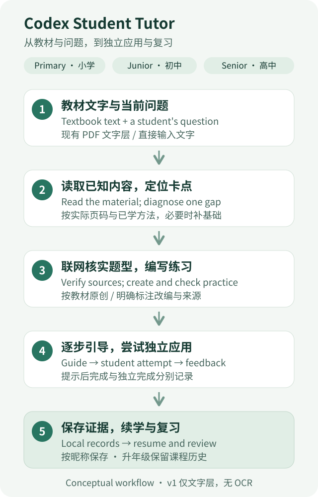

# Codex Student Tutor

### Textbook-based tutoring skills for students in China's schools

**Turn textbook text and student questions into guided lessons, original practice, feedback, and review. Three Codex skills adapt to primary, junior secondary, and senior secondary study, with local textbook indexes and learning records that continue across sessions.**

English | [中文](README_ZH.md)

[Quick Start](#quick-start) · [Skills](#skills) · [Learning Records](#learning-records) · [Documentation](#documentation)



*Conceptual workflow of the tutoring skills. Version 1 reads existing PDF text layers.*

## What you can do

- **Learn from your own materials.** Start with a question, pasted text, or a textbook PDF, and follow methods within the material you have actually studied.
- **Work one step at a time.** Diagnose a specific gap, receive progressively stronger hints, and try a new problem independently. Request a complete explanation whenever needed.
- **Practice with checked question patterns.** Codex searches and opens relevant sources before creating original or clearly labeled adapted questions, then solves and checks each new question. If sources cannot be verified, practice is labeled as original work based on the textbook.
- **Resume with evidence.** Keep textbook locations, answers, reasoning, assistance levels, and review dates in local records, separated by learner nickname.
- **Revisit earlier foundations.** A student's current grade and a textbook's grade are stored separately. Moving to another grade or school stage preserves earlier courses and attempts.

## Skills

| Skill | Students | Teaching emphasis |
| --- | --- | --- |
| [`cn-primary-tutor`](skills/cn-primary-tutor/SKILL.md) | Primary school, grades 1–6 | Concrete examples, reading the question, diagrams described in text, arithmetic, and short steps |
| [`cn-junior-tutor`](skills/cn-junior-tutor/SKILL.md) | Junior secondary school, grades 7–9 | Concept relationships, modeling, clear solution steps, and evidence from materials |
| [`cn-senior-tutor`](skills/cn-senior-tutor/SKILL.md) | Senior secondary school, years 1–3 | Derivations, combined applications, case analysis, conditions, and boundaries |

All three teach in Chinese. Subject strategies cover languages, mathematics, natural sciences, humanities and social studies, information technology, arts, physical education and health, labor, and integrated practical activities; senior secondary also includes general technology. The actual textbook, selected subjects, and modules determine scope. Open-ended answers are assessed against the task and evidence, allowing defensible alternatives. Practical, audio, and visual subjects use text descriptions in version 1.

## Quick Start

### 1. Install the skills

Copy the complete directories you need from `skills/` into `.agents/skills/` inside your learning workspace:

```text
<learning-workspace>/
└── .agents/
    └── skills/
        ├── cn-primary-tutor/
        ├── cn-junior-tutor/
        └── cn-senior-tutor/
```

Each directory is self-contained: `SKILL.md`, `agents/openai.yaml`, references, and scripts must remain together. You may instead use the personal skills directory already configured and recognized by your current Codex environment. Avoid duplicate installations of the same named skill. If a skill does not appear, restart Codex. See the [official skills documentation](https://learn.chatgpt.com/docs/build-skills).

### 2. Prepare PDF reading

Use Python 3.9 or later. From your learning workspace, install the PDF dependency for an installed skill:

```sh
python -m pip install -r ".agents/skills/cn-primary-tutor/scripts/requirements.txt"
```

The three skills share the same dependency requirement: `pypdf>=5,<7`. If you installed a different skill or used a personal directory, replace the path with that installed directory's `scripts/requirements.txt`. The learning-record tool uses only the Python standard library. Tools do not install dependencies automatically.

### 3. Start a lesson

Open your learning workspace in Codex. Put a textbook PDF there, supply an accessible attachment, or paste the relevant text. Version 1 works with existing PDF text layers; for a scanned page or missing diagram, type the question and its essential conditions.

Choose the matching skill. These student examples intentionally remain in Chinese:

```text
使用 $cn-primary-tutor。我五年级，教材是“数学五年级下册.pdf”，从分数加法开始。请先看看我哪里不会，再逐步教我。
```

```text
使用 $cn-junior-tutor。我初二，读“数学八年级.pdf”中一次函数这一节，先诊断基础，再出题练习。
```

```text
使用 $cn-senior-tutor。我高二，学习“数学选择性必修.pdf”的导数章节。按教材方法辅导，最后给一道综合验证题。
```

Later, say “继续上次的学习”, “换个讲法”, “直接给我完整解析”, “出题考我”, or “复习上次的错题”. The default learner ID is `student-1`. In a shared workspace, use a different nickname ID for each student, such as `learner-a`; IDs accept ASCII letters, digits, underscores, and hyphens.

## Learning Records

Records stay in the current learning workspace under `.student-tutor/learners/<nickname>/`, separate from the installed skill:

| Record | What is kept |
| --- | --- |
| Textbook index | Source, optional SHA-256, textbook stage and grade, topics, prerequisites, actual PDF page numbers, and read status |
| Learning evidence | Question, student answer and reasoning, result, assistance level, feedback, supported error causes, and review date |
| Current profile | Nickname, current school stage, and grade; earlier courses and attempts remain when these are updated |

Independent completion, completion with hints, and studying an explanation are recorded separately. A correct answer after help does not become an independent pass, and the tool does not certify mastery from a success rate. Later independent questions and review provide further evidence.

Records are not automatically synced to an external service. During a lesson, relevant textbook excerpts and records are used in the current Codex conversation. Review dates help choose future practice; they do not create reminders or send reports.

Use a nickname rather than a real name, school, or contact details. This repository ignores `.student-tutor/`. When copying skills into an existing project, add that rule to its existing `.gitignore` without replacing other rules.

## Version 1 Boundaries

- **Existing PDF text only.** No OCR, image understanding, handwriting, audio, or video recognition. Missing geometric, circuit, map, or experimental conditions must be supplied in text before drawing a unique conclusion.
- **Read in batches.** The PDF tool defaults to at most 12 pages per call. PDF page numbers start at 1 and may differ from printed textbook page numbers. Truncated long pages include a character-offset continuation instruction.
- **Check uncertain extraction.** Formulas, tables, and reading order may need confirmation. A table of contents or extracted text is not proof that all textbook content has been read or understood.
- **Verify sources and answers.** Search snippets alone do not count as checked sources. New questions are solved again after their conditions change; exam scope is checked for the relevant region and year.

The bundle includes no API keys, model weights, textbooks, or question-bank content.

## Documentation

- [Primary skill and references](skills/cn-primary-tutor/SKILL.md)
- [Junior secondary skill and references](skills/cn-junior-tutor/SKILL.md)
- [Senior secondary skill and references](skills/cn-senior-tutor/SKILL.md)
- [Tool validation notes (Chinese)](docs/validation.md)

To check the tools and the packaged skill copies, run from this repository's root:

```sh
python -B -m unittest discover -s tests -v
python -B tools/verify_bundle.py
```

The suite contains 64 tests: 22 for PDF extraction and 42 for learning records. The documented validation environment is Windows, Python 3.9.25, and pypdf 6.18.0. Tool checks do not establish long-term educational effectiveness.

The [automated tool checks](.github/workflows/ci.yml) run these same commands on Ubuntu and Windows with Python 3.9 and 3.12 for pushes and pull requests. They can also be started manually from [GitHub Actions](https://github.com/cloudwallker/codex-student-tutor/actions/workflows/ci.yml). The checks use synthetic materials and temporary learning records; no textbook uploads, student data, or API keys are needed.

## Sources and Acknowledgments

The tutoring instructions are original. Their organization and teaching approaches draw on the projects below; upstream prose, textbooks, and question banks are not copied into this bundle.

- [hermes-edu-skills](https://github.com/hezkvectory/hermes-edu-skills): Chinese education context, textbook alignment, and error review.
- [study-assistant-skills](https://github.com/2362094903-ops/study-assistant-skills): Chapter-based learning, question patterns, and traceable records.
- [ai-teaching-skills](https://github.com/bstellato/ai-teaching-skills): Guided steps, explanation comparison, and student self-explanation.
- [school-skills](https://github.com/Jellypod-Inc/school-skills): Demonstration, scaffolding, and independent application.
- [teacher-skill](https://github.com/chentao326/teacher-skill): Diagnosis and subject-specific strategies.
- [pypdf text-extraction documentation](https://pypdf.readthedocs.io/en/stable/user/extract-text.html): The boundary between existing text layers and image recognition.
